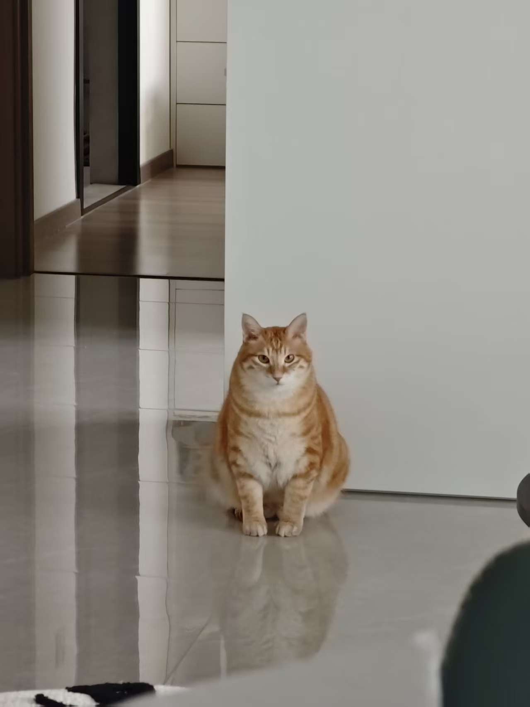

# AGENTS.md - 项目指南

> 本文档面向 AI 编程助手，用于快速了解本项目架构和开发规范。

## 项目概述

**项目名称**: 我们的家 | Our Family  
**类型**: 纯静态单页网站 (GitHub Pages)  
**域名**: www.yellowd.com.cn (通过 CNAME 配置)  
**语言**: 中文 (zh-CN)

这是一个温馨的家庭展示网站，记录两只可爱猫咪（窝窝、伊伊）和两位铲屎官（YellowD、简单）的幸福生活。

---

## 技术栈

### 核心技术
- **HTML5** - 语义化标记
- **CSS3** - 原生样式，无预处理器
- **JavaScript (ES6+)** - 原生脚本，无框架

### 技术特性
- **CSS Variables** - CSS 变量管理主题色彩
- **CSS Grid & Flexbox** - 响应式布局
- **Google Fonts** - Inter + Noto Sans SC 字体
- **Intersection Observer API** - 动画触发（预留）

### 无依赖
- 无构建工具 (No Webpack/Vite/Rollup)
- 无前端框架 (No React/Vue/Angular)
- 无 CSS 框架 (No Bootstrap/Tailwind)

---

## 项目结构

```
.
├── index.html          # 主页面（单体应用：包含所有 HTML、CSS、JS）
├── README.md           # 项目说明文档（中文）
├── CNAME               # GitHub Pages 自定义域名配置
├── .gitignore          # Git 忽略文件（当前为空）
└── images/             # 静态图片资源
    ├── cats/           # 猫咪头像/封面照
    │   ├── 窝窝.jpg
    │   └── 伊伊.jpg
    ├── wo/             # 窝窝的日常照片 (窝窝1.jpg ~ 窝窝6.jpg)
    ├── yi/             # 伊伊的日常照片 (伊伊1.jpg ~ 伊伊4.jpg)
    ├── beer/           # 精酿啤酒收藏照片 (啤酒1.jpg ~ 啤酒7.jpg)
    └── flowers/        # 花卉照片 (花1.jpg ~ 花15.jpg)
```

### 关键文件说明

| 文件 | 说明 |
|------|------|
| `index.html` | **唯一源代码文件**，约 700 行，包含完整的 HTML 结构、CSS 样式和 JavaScript 逻辑 |
| `CNAME` | 自定义域名配置，内容为 `www.yellowd.com.cn` |
| `images/` | 所有图片资源，按类别分文件夹存放 |

---

## 代码架构

### 单文件架构
整个应用是一个单文件架构，所有代码都在 `index.html` 中：

1. **`<head>` 区域** (行 1-388)
   - Meta 标签和标题
   - Google Fonts 引用
   - CSS 样式（内嵌 `<style>` 标签）

2. **`<body>` 区域** (行 389-678)
   - 导航栏 (`<nav>`)
   - 主内容区 (`<main>`) - 包含 5 个 section
   - 页脚 (`<footer>`)
   - 灯箱组件 (`#lightbox`)

3. **`<script>` 区域** (行 680-707)
   - JavaScript 逻辑

### Section 结构
- `#home` - 首页/家庭总览（4 张卡片网格）
- `#wo` - 窝窝的个人资料页
- `#yi` - 伊伊的个人资料页
- `#yellowd` - YellowD 的个人资料页
- `#jiandan` - 简单的个人资料页

### CSS 架构
- **CSS Variables** (行 9-23): 定义主题色彩
- **Reset** (行 25): 通用重置
- **组件样式**: 按功能模块组织（Navigation、Card、Profile、Gallery 等）
- **响应式** (行 377-386): `@media (max-width: 768px)` 移动端适配

### JavaScript 函数
```javascript
showSection(sectionId)    // 切换页面区块
openLightbox(imgSrc)      // 打开图片灯箱
closeLightbox()           // 关闭灯箱
```

---

## 样式规范

### 主题色彩 (CSS Variables)
```css
--bg-warm: #fef7f0;        /* 暖色背景 */
--bg-cream: #fff8f0;       /* 奶油色背景 */
--primary: #ff8c42;        /* 主色：暖橙色 */
--primary-light: #ffb380;  /* 浅橙色 */
--secondary: #6b5b95;      /* 辅助色：紫色 */
--accent-green: #88b04b;   /* 强调绿 */
--accent-blue: #3498db;    /* 强调蓝 */
--accent-pink: #e91e63;    /* 强调粉 */
--text-dark: #2d3436;      /* 深色文字 */
--text-light: #636e72;     /* 浅色文字 */
```

### 成员配色方案
| 成员 | 主题色 | 用途 |
|------|--------|------|
| 窝窝 | `#ff8c42` (橙) | 卡片边框、进度条、标签 |
| 伊伊 | `#6b5b95` (紫) | 卡片边框、进度条、标签 |
| YellowD | `#3498db` (蓝) | 卡片边框、进度条、标签 |
| 简单 | `#e91e63` (粉) | 卡片边框、进度条、标签 |

### 类名命名规范
- 使用小写字母和连字符：`family-card`, `profile-header`
- 成员特定样式使用成员标识符：`wo`, `yi`, `blue`, `pink`
- 状态类：`active`, `hover`

---

## 开发指南

### 如何修改内容

1. **修改文字内容**: 直接编辑 `index.html` 中的文本
2. **更换图片**: 
   - 替换 `images/` 目录下的图片文件
   - 保持文件名一致，或同时修改 HTML 中的 `src` 属性
   - 图片加载失败时会显示占位图 (placehold.co)

### 添加新成员页面

如需添加新的家庭成员页面：

1. 在 `<nav>` 中添加导航按钮
2. 在 `<main>` 中新增 `<section id="newid">` 区块
3. 参考现有 profile 结构复制模板
4. 定义新的 CSS 配色类
5. 在 `showSection()` 的 `navMap` 中添加映射

### 图片加载失败处理

所有图片都有 `onerror` 回退：
```html

```

---

## 部署

### 部署方式
本项目是纯静态网站，可部署到任意静态托管服务：

1. **GitHub Pages** (当前使用)
   - 已配置 `CNAME` 文件指向 `www.yellowd.com.cn`
   - 直接推送到仓库即可自动部署

2. **其他平台**
   - Vercel / Netlify - 拖拽上传
   - Nginx / Apache - 复制文件到网站目录

### 无构建步骤
- 无需 `npm install`
- 无需编译或打包
- 直接部署 `index.html` 和 `images/` 文件夹

---

## 浏览器兼容性

- 现代浏览器（Chrome、Firefox、Safari、Edge）
- 支持 CSS Grid 和 Flexbox
- 支持 CSS Variables
- 移动端响应式适配

---

## 注意事项

1. **单体文件**: 所有代码在一个 HTML 文件中，修改时需注意结构和样式的对应关系
2. **中文文件名**: `images/` 目录包含中文文件名（如 `窝窝.jpg`、`啤酒1.jpg`），确保服务器支持 UTF-8
3. **外部依赖**: 依赖 Google Fonts 和 placehold.co（图片加载失败时），离线环境需处理
4. **图片优化**: 当前无图片压缩或懒加载机制，大量图片可能影响首次加载速度

---

## License

MIT License - 欢迎自由使用和修改

---

*Made with ❤️ for our furry family members*
